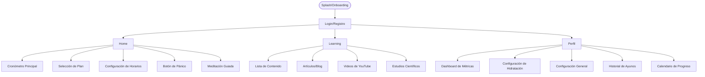

Aquí tienes el texto sin los símbolos "*" y "#":

Documento 2: App Flow Document - Zendfast

> **Resumen:** Este documento describe el flujo de navegación, jerarquía de pantallas, flujos funcionales, estados, transiciones, configuraciones, métricas, notificaciones y casos especiales de la app Zendfast. Sirve como blueprint de experiencia de usuario y lógica de navegación para desarrolladores y diseñadores.

---

## Diagrama General de Navegación



---

1. Información General del Flujo

> **Resumen:** Introduce la estructura de navegación principal, el patrón de navegación y las pantallas clave de la app. Define la base para todos los flujos de usuario.

Aplicación: Zendfast  
Tipo de Navegación: Tab Bar Inferior  
Pantallas Principales: 3 (Home, Learning, Perfil)  
Patrón de Navegación: Stack Navigation + Tab Navigation  

2. Arquitectura de Navegación

> **Resumen:** Detalla la jerarquía de pantallas, la estructura de stacks y tabs, y la relación entre las diferentes secciones de la app. Asegura consistencia con los nombres y rutas definidos en los otros documentos.

  2.1 Estructura Principal

Tab Bar Inferior:
├── Home (Pantalla Principal)
├── Learning (Contenido Educativo)
└── Perfil (Métricas + Configuración)


 2.2 Jerarquía de Pantallas

Home Stack:
- Cronómetro Principal (pantalla inicial post-onboarding)
- Selección de Plan de Ayuno
- Configuración de Horarios
- Botón de Pánico (modal/overlay)
- Meditación Guiada (pantalla completa)

Learning Stack:
- Lista de Contenido
- Artículos/Blog
- Videos de YouTube
- Estudios Científicos

Perfil Stack:
- Dashboard de Métricas
- Configuración de Hidratación
- Configuración General
- Historial de Ayunos
- Calendario de Progreso

3. Flujos Detallados por Funcionalidad

> **Resumen:** Describe paso a paso los flujos funcionales principales (cronómetro, pánico, meditación, hidratación, cambio de plan), incluyendo triggers, estados y transiciones. Incluye comentarios para aclarar decisiones de UX y manejo de errores.

3.1 Flujo Principal - Cronómetro (Home)

Estado: En Ayuno
Cronómetro (Cuenta Regresiva) → Tiempo restante hasta fin de ayuno
├── Botón de Pánico (Centro-Inferior, Flotante)
├── Botón de Hidratación (Inferior-Izquierda, Flotante)
├── Cambiar Plan (Inferior)
└── Notificaciones Push (Motivación + Agua)

Estado: Ventana de Alimentación
Cronómetro (Pausado/Inactivo) → Tiempo hasta próximo ayuno
├── Botón Iniciar Ayuno
├── Botón de Hidratación (Inferior-Izquierda, Flotante)
├── Cambiar Plan (Inferior)
└── Notificaciones Push (Solo Agua + Motivación General)

3.2 Flujo del Botón de Pánico

> **Comentario:** El botón de pánico solo está disponible durante el ayuno activo para evitar acciones accidentales. El modal ofrece opciones de ayuda y registro de interrupción, y debe ser accesible (labels, focus, feedback háptico). Si el usuario pierde conexión, se muestra un mensaje de error y se permite reintentar o volver a Home.

Activación: Solo accesible desde Home cuando está en período de ayuno

Botón de Pánico (Presionado)
├── Modal/Overlay con:
│   ├── Frases Motivacionales
│   ├── Recomendaciones Anti-Atracones
│   └── Opciones:
│       ├── "Meditar" → Flujo de Meditación
│       └── "Rompí el ayuno" → Registro de Interrupción

3.3 Flujo de Meditación Guiada

> **Comentario:** La meditación guiada utiliza animaciones visuales y feedback auditivo. Si el usuario sale antes de completar, se registra como intento fallido. El flujo debe ser accesible (descripciones para lectores de pantalla, opción de pausar animaciones). Si ocurre un error (por ejemplo, animación no carga), se muestra un mensaje y se permite volver a Home.

Técnica: 4-4-8 (Inhalar 4s, Mantener 4s, Exhalar 8s)

Meditación (Pantalla Completa)
├── Animación de Respiración Visual
├── Contador de Ciclos
├── Botones de Control:
│   ├── Pausar/Reanudar
│   └── Salir
└── Al Completar:
    ├── "Seguir con el ayuno" → Regreso a Home
    └── "No aguanto" → Registro de Interrupción

3.4 Flujo de Hidratación

> **Comentario:** El botón de hidratación debe ser grande y fácil de tocar (mínimo 44x44px). Si falla el registro por pérdida de red, se almacena localmente y se sincroniza al recuperar conexión. El progreso visual debe ser accesible (contraste, labels).

Configuración Inicial:
- Usuario define ml por vaso (ej: 250ml)
- Sistema calcula cantidad diaria requerida (peso/altura)

Uso Diario:
Botón de Hidratación (Redondo, Flotante)
├── Click → Suma cantidad configurada (ej: +250ml)
├── Progreso Visual → Barra/Porcentaje del objetivo diario
├── Notificaciones Push → Recordatorios automáticos
└── Registro en Perfil → Historial de hidratación

3.5 Flujo de Cambio de Plan

> **Comentario:** Al cambiar de plan, se debe confirmar la acción y mostrar advertencias si hay un ayuno activo. Si ocurre un error de red, se permite reintentar o cancelar el cambio.

Acceso: Desde Home (disponible en cualquier momento)

Cambiar Plan
├── Lista de Planes Disponibles:
│   ├── 12/12, 14/10, 16/8, 18/6
│   ├── 24 horas, 2 días
│   └── Plan Personalizado
├── Confirmación de Cambio
└── Actualización del Cronómetro

4. Estados y Transiciones

> **Resumen:** Define los estados principales del cronómetro y las transiciones críticas entre ayuno y ventana de alimentación. Incluye recomendaciones para feedback visual y manejo de errores.

4.1 Estados del Cronómetro

Estado 1: Ayuno Activo
- Cronómetro: Cuenta regresiva
- Botón de Pánico: Visible y activo
- Fondo: Indicador visual de ayuno
- Notificaciones: Motivación + Agua

Estado 2: Ventana de Alimentación
- Cronómetro: Pausado o próximo ayuno
- Botón de Pánico: Oculto/Inactivo
- Fondo: Indicador visual de alimentación
- Notificaciones: Solo agua + motivación general

4.2 Transiciones Críticas

> **Comentario:** Todas las transiciones deben tener feedback visual (animaciones, mensajes) y ser accesibles. Si ocurre un error (por ejemplo, notificación no se puede programar), se informa al usuario y se permite reintentar.

Inicio de Ayuno:
Ventana de Alimentación → Confirmar Inicio → Ayuno Activo
├── Cronómetro se activa
├── Botón de Pánico se habilita
└── Notificaciones de ayuno se activan

Fin de Ayuno:
Ayuno Activo → Tiempo Completado → Ventana de Alimentación
├── Notificación de éxito
├── Registro en métricas
└── Botón de Pánico se oculta

5. Flujos de Configuración

> **Resumen:** Describe los flujos de configuración de hidratación y generales, asegurando que todas las opciones sean accesibles y fáciles de modificar. Incluye recomendaciones para testing en diferentes dispositivos y orientación.

5.1 Configuración de Hidratación (Perfil)

> **Comentario:** Los campos deben tener validación en tiempo real y feedback claro. Si falla la sincronización, se informa al usuario y se permite guardar localmente.

Perfil → Configuración de Hidratación
├── Cantidad por Vaso (ml)
├── Objetivo Diario Automático
├── Frecuencia de Recordatorios
└── Historial de Consumo

5.2 Configuración General (Perfil)

> **Comentario:** Las opciones de accesibilidad (tema, notificaciones, sonidos) deben ser fácilmente ajustables. Probar en modo oscuro/claro y con diferentes tamaños de fuente.

Perfil → Configuración
├── Tema: Modo Oscuro/Claro
├── Notificaciones:
│   ├── Inicio/Fin de Ayuno
│   ├── Recordatorios de Agua
│   ├── Motivación durante Ayuno
│   └── Noticias Educativas (opcional)
├── Sonidos y Vibraciones
└── Privacidad y Datos

6. Flujos de Contenido (Learning)

> **Resumen:** Detalla la navegación y manejo de contenido educativo, incluyendo búsqueda, favoritos y manejo de conectividad. Asegura consistencia de términos con el resto de la app.

6.1 Navegación de Learning

Learning Tab
├── Categorías de Contenido:
│   ├── Artículos/Blog
│   ├── Videos de YouTube
│   ├── Estudios Científicos
│   └── Guías Prácticas
├── Búsqueda de Contenido
└── Contenido Favorito

6.2 Manejo de Conectividad

> **Comentario:** Si no hay conexión, se muestra un estado vacío amigable y opciones para reintentar o volver a Home. El contenido favorito debe estar disponible offline si es posible.

Sin Conexión:
Learning → Error de Conexión
├── Mensaje: "No hay conexión a internet"
├── Botón: "Verificar conexión"
└── Botón: "Volver a la página principal"

7. Flujos de Métricas y Progreso (Perfil)

> **Resumen:** Explica cómo se visualizan y gestionan las métricas, el historial y los gráficos de progreso. Incluye recomendaciones para accesibilidad y exportación de datos.

7.1 Dashboard de Métricas

Perfil → Métricas
├── Calendario de Ayunos
├── Estadísticas:
│   ├── Horas Totales (Semanal/Mensual)
│   ├── Ayunos Completados
│   ├── Racha Actual
│   └── Progreso de Hidratación
├── Gráficos de Progreso
└── Análisis de Patrones

7.2 Historial Detallado

Métricas → Historial
├── Calendario Visual
├── Detalles por Día:
│   ├── Duración del Ayuno
│   ├── Hora de Inicio/Fin
│   ├── Interrupciones (si las hubo)
│   └── Consumo de Agua
└── Exportar Datos

8. Flujos de Segundo Plano

> **Resumen:** Describe el comportamiento de la app en segundo plano, la persistencia de datos y el manejo de notificaciones. Incluye comentarios sobre sincronización y manejo de errores.

8.1 App en Segundo Plano

> **Comentario:** El cronómetro y las notificaciones deben seguir funcionando en background. Si la app es cerrada por el sistema, se debe restaurar el estado al reabrir. Probar en diferentes dispositivos y versiones de SO.

Funcionalidad Continua:
- Cronómetro sigue funcionando
- Notificaciones push activas
- Datos se sincronizan al reabrir

Cierre de Sesión/Eliminación:
- Cronómetro se detiene
- Notificaciones se desactivan
- Datos locales se mantienen hasta reinstalación

8.2 Notificaciones Push

> **Comentario:** Todas las notificaciones deben ser accesibles (texto claro, opción de desactivar). Probar la recepción en diferentes escenarios (app abierta, cerrada, background).

Tipos de Notificaciones:
1. Inicio de Ayuno: "¡Tu ayuno ha comenzado! 💪"
2. Fin de Ayuno: "¡Ayuno completado! 🎉 Tiempo para comer"
3. Recordatorio de Agua: "💧 Recuerda hidratarte"
4. Motivación: "¡Vas muy bien! Ya llevas X horas"
5. Educativas: "¿Sabías que...?" (opcional)

9. Casos de Uso Especiales

> **Resumen:** Incluye flujos para interrupción del ayuno y cambio de zona horaria, asegurando que el usuario siempre reciba feedback y pueda recuperar el control si ocurre un error.

9.1 Interrupción del Ayuno

> **Comentario:** Si el usuario interrumpe el ayuno, se debe registrar el motivo y permitir reiniciar fácilmente. Si falla el registro, se almacena localmente y se sincroniza después.

Botón de Pánico → "Rompí el ayuno"
├── Registro de Interrupción
├── Tiempo Parcial Completado
├── Pregunta: "¿Qué pasó?"
├── Opciones para Reiniciar
└── Actualización de Métricas

9.2 Cambio de Zona Horaria

> **Comentario:** Al detectar un cambio de zona, se debe informar al usuario y ajustar los horarios automáticamente. Si ocurre un error, se permite ajustar manualmente.

Detección de Cambio de Zona
├── Notificación al Usuario
├── Ajuste Automático del Cronómetro
└── Confirmación de Nuevos Horarios

10. Flujos de Onboarding (Referencia)

> **Resumen:** Detalla el flujo de onboarding, desde splash hasta la pantalla principal, con pasos claros y recomendaciones para accesibilidad y testing. Incluye un mini-diagrama visual.

Secuencia Completa:
Splash Screen → Introducción → Registro/Login → Cuestionario → 
Paywall → Detox[Plan de Desintoxicación] → Selección de Plan → 
Configuración de Hidratación → Home (Cronómetro)

```mermaid
graph LR
    Splash --> Intro[Introducción]
    Intro --> Registro[Registro/Login]
    Registro --> Cuestionario[Cuestionario]
    Cuestionario --> Paywall[Paywall]
    Paywall --> Detox[Plan de Desintoxicación]
    Detox --> SeleccionPlan[Selección de Plan]
    SeleccionPlan --> Hidratacion[Configuración de Hidratación]
    Hidratacion --> Home[Home (Cronómetro)]
```

> **Guía de testing responsive y accesibilidad:**
> - Probar el onboarding en dispositivos pequeños, medianos y grandes.
> - Verificar que todos los pasos sean accesibles (labels, hints, contraste, navegación por teclado).
> - Simular errores de red y verificar mensajes y recuperación.
